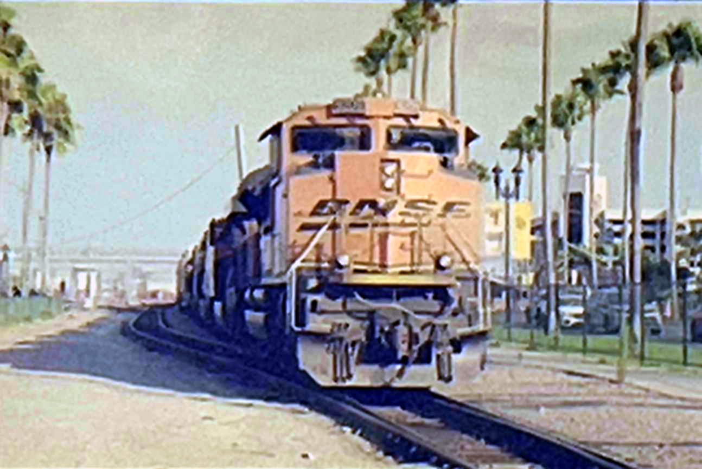
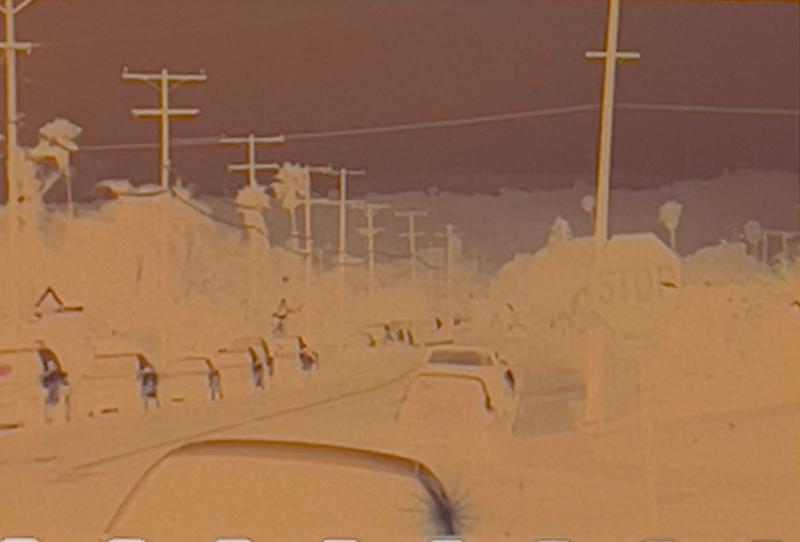
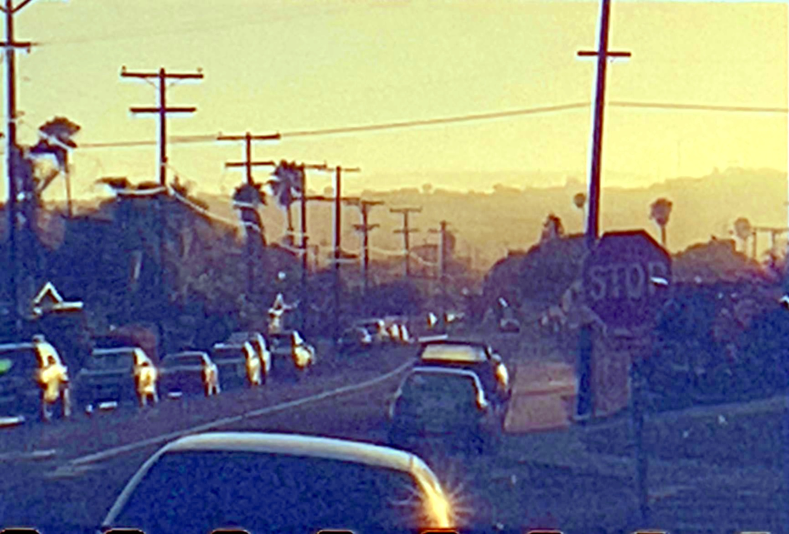

# CNN(ResNet18) for Film (Color Negatives) Detection 

## Background

Before digital cameras and image technology (2000s), film cameras and analog technology were the only choice for photography / movies, leaving films and negatives for file storage. But 
there are some limitations to use film as files, because of the following reasons.  

1. **Overexposure/Underexposure**. Overexposuing or underexposing makes the films unable to catch sufficient details. After converting negatives into normal images,
   noise would be enriched, making the pictures not readable.  
2. **Improper chemical processing** After filming, chemical processing is needed for people to see what they have shot. Chemical processing includes developing (use developer liquid),
   blix(use bleach + fixer), water washing and stabilizing (use stabilizer, optional). Improper chemical processing such as uneven development, fading liquid effect,
   and incomplete reaction can destroy the content of films, making them unable to rea. Improper chemical processing directly leads to large blank areas on films, artifacts, residual blank spots,
   color patches, accidental imprints, et al.
3. **Improper storage**. Holes can be on films. Long term storage could lead to color fading. Recoiling films could lead to dye removal as well.

To detect whether a negative film is readable in a short time, I developed and train a ResNet 18 model. I marked the films 1 if the film is normal or 0 otherwise. The pipeline and the structure of 
the model will be discussed later.  

## Examples of the films from the dataset

Due to privacy issue, I am not able to provide all the pictures used for training. Here are some examples so you can understand how I define normal and abnormal pictures.  
Use cvt2pos function in Convert.ipynb to convert from negative films to positive (readable) images. 

here are the normal films:
| Negative | Positive |
|----------|--------- |
| |  |
| |  |
| |  |
| |  |

here are the abnormal films:
| Negative | Positive | Issue | Reason |
|----------|----------|-------|--------|
| |  | Big Blank Area | Uneven Development |
| |  | Residual Spot | Fading Liquid Effect |
| |  | Noise | Underexposure |
| |  | Color Patches | Fading Liquid Effect |
| |  | Holes | Folding / Improper storage |
