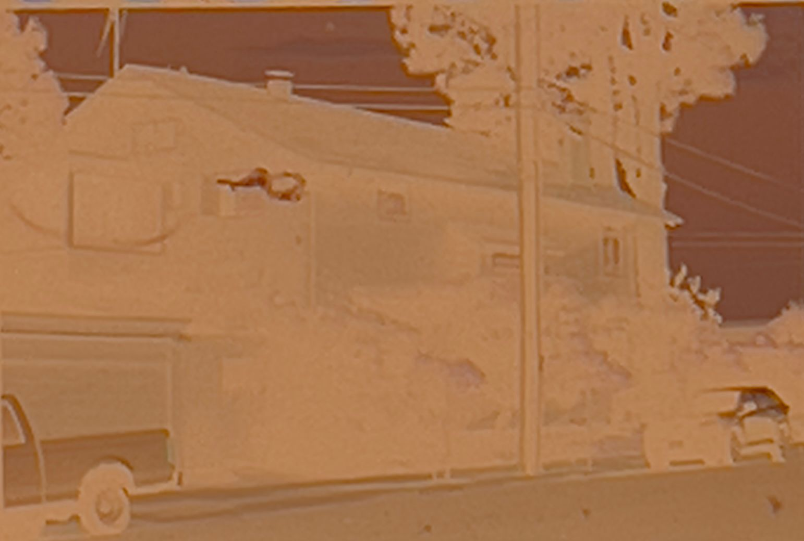
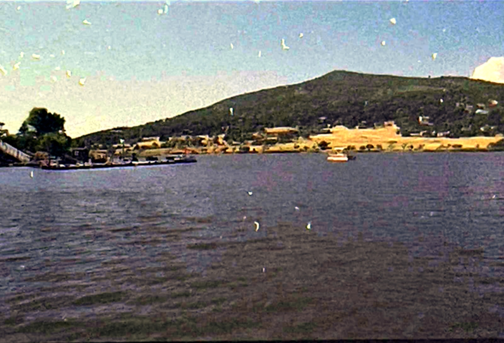

# CNN(ResNet18) for Film (Color Negatives) Detection 

## Background

Before digital cameras and image technology (2000s), film cameras and analog technology were the only choice for photography / movies, leaving films and negatives for file storage. But 
there are some limitations to use film as files, because of the following reasons.  

1. **Overexposure/Underexposure**. Overexposuing or underexposing makes the films unable to catch sufficient details. After converting negatives into normal images,
   noise would be enriched, making the pictures not readable.  
2. **Improper chemical processing** After filming, chemical processing is needed for people to see what they have shot. Chemical processing includes developing (use developer liquid),
   blix(use bleach + fixer), water washing and stabilizing (use stabilizer, optional). Improper chemical processing such as uneven development, fading liquid effect,
   and incomplete reaction can destroy the content of films, making them unable to rea. Improper chemical processing directly leads to large blank areas on films, artifacts, residual blank spots,
   color patches, accidental imprints, et al.
3. **Improper storage**. Holes can be on films. Long term storage could lead to color fading. Re-coiling films could also lead to dye removal due to friction.

To detect whether a negative film is **readable**, I developed and train a ResNet 18 model. I marked the films 1 if the film is normal or 0 otherwise. The pipeline and the structure of 
the model will be discussed later.  

## Examples of the films from the dataset

Due to privacy issue, I am not able to provide all the pictures used for training. Here are some examples so you can understand how I define normal and abnormal pictures.  
Use cvt2pos function in Convert.ipynb to convert from negative films to positive (readable) images. 

here are the normal films:
| Negative | Positive |
|----------|--------- |
| |  |
| |  |
| |  |
| |  |
| |  |
| |  |

here are the abnormal films:
| Negative | Positive | Issue | Reason |
|----------|----------|-------|--------|
| |  | Noise | Underexposure |
| |  | Big Blank Area | Uneven Development |
| |  | Color Patches | Fade Developer |
| |  | Residual Spot | Fade Developer |
| |  | Holes | Folding Films / Improper storage |
| |  | Dye Removal | Re-coiling Films |

**Additional Info**

1. Normal:Abonormal ~ 7:3 
2. Some films can have more than 1 problem.
3. Different problems can lead to similar consequence. (e.g. dye removal & color patches)
4. Slightly color-shifted photos are considered normal as they are readable.
5. All 494 film clips were taken by me between July and September in 2025. I used Nikon F2 and Nikon Nikkormat FT3 as my cameras, and Kodak Gold 200, Kodak UltraMax 400, Kodak ColorPlus 200, and Fujifim 400 for my color negatives. All color negatives were developed by me and retaken by phone. 

## Model Structure

The model I used is ResNet18, whose basic structure is a ResNet block. 

A Residual Network block consists of the following structures: (reference from https://d2l.ai/chapter_convolutional-modern/resnet.html)
1. 2 layers, each layer has a convolutional layer and a batch norm layer
2. a bypassing channel which adds input X with 1 or Identity matrix
3. adding the results coming from the 2 layers and the bypassing channel if there is a bypassing channel, otherwise adding X with the 2 layers
4. then the last layer with a conv layer and a batch norm layer

The resnet 18 sequential network consists of: (reference from https://d2l.ai/chapter_convolutional-modern/resnet.html)

Conv -> BatchNorm -> MaxPool -> Resnet Block w/o bypass -> Resnet Block w/o bypass -> Resnet Block w/ bypass -> Resnet Block w/o bypass -> Resnet Block w/ bypass -> Resnet Block w/o bypass - >Resnet Block w/ bypass -> Resnet Block w/o bypass -> AveragePool -> FC layer

## Training Pipeline
1. Collect photos of the negatives, and use cvt2pos function to obtain their positive images. Label the condition of films manually (eg, 1 for normal, 0 for abnormal) 
2. Load the same photos of film clips into two datasets. One is pandas.DataFrame, used for retrieving pictures given indices.  Another one is a Custumized data set used for data split into different batches for training and testing.
3. Transform the pictures in Custumized data set to be of the same shape (244 x 244), then split them into training and teating batches.
4. Create Resnet Block and ResNet18.
5. Train the model for 10 epoches. For each epoch, test the model on the test data batches, and record the accuracy rate, training loss, validation loss, and f1 score. Use AdamW as the optimizer. Use ReduceLROnPlateau to regulate the learning rate in case the learning performance gets stuck. F1 score is an estimator when both classes (normal, abnormal) is not even.
6. Plot the changes of accuracy rate, training loss, validation loss, and F1 score in the 10 epoches. Plot the changes of learning rate as a reference.
7. Test the model on the test data batches. Compute the accuracy rate, f1 score, precision rate, and recall rate. Then print all the misclassified pictures for further correction.

## Results and Analysis

